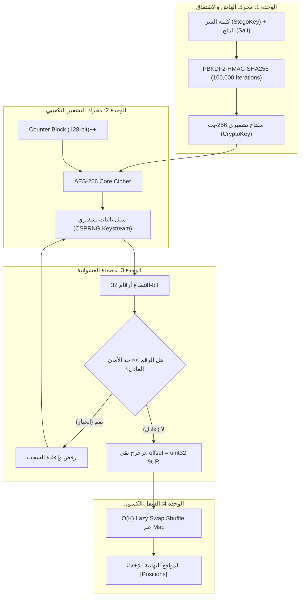

# خطة التحديث المعماري والتطبيقي لمحرك التشفير وتوليد المواضع (PRNG Modernization Plan)

تحدد هذه الوثيقة الخطة التنفيذية والتطبيقية الدقيقة لتحديث ملف [`js/core/stego/prng-generator.js`](../js/core/stego/prng-generator.js) وتحويله من الآلية القديمة المحدودة أمنياً إلى البنية المعمارية التشفيرية الحديثة المعتمدة في تقرير [`report_print.html`](../report_print.html)، مع الالتزام الصارم بمبادئ الكود النظيف [`Cleancode.md`](../.agent/Skills/Code/Cleancode.md) وأقل تعقيد زمني ومكاني ممكن $O(K)$.

---

## 1. الفجوة المعمارية والهدف من التحديث

| المحور | الوضع الحالي في `prng-generator.js` (Legacy) | الوضع المستهدف بعد التطبيق (Target Modern) |
|---|---|---|
| **اشتقاق المفتاح** | دالة `DJB2` (هاش ضعيف 32-بت، مساحة $2^{32}$) | خوارزمية `PBKDF2-HMAC-SHA256` (100,000 دورة تكرارية، عمق 256-بت) |
| **محرك العشوائية** | مولد `Mulberry32` (خطي، سهل كشف الحالة) | محرك `AES-256-CTR CSPRNG` (تشفيري آمن، غير قابل للتنبؤ) |
| **تقليص النطاق** | باقي القسمة `Math.floor(rng() * range)` (Modulo Bias) | السحب المرفوض `Unbiased Rejection Sampling` (توزيع عادل 100%) |
| **خوارزمية الشفل** | مصفوفة كاملة `Array.from({ length: maxLength })` ($O(N)$ RAM) | تبديل كسول `O(K) Lazy Swap` عبر `Map` ($O(K)$ Memory & Time) |
| **التوافقية البرمجية** | دوال متزامنة `generatePositions(maxLength, count, key)` | الحفاظ على نفس التوقيع التزامني دون كسر أي كود مرتبط |

---

## 2. الهيكلية المعمارية للوحدات البرمجية المستهدفة (Architecture Modules)

سيتم تنظيم ملف [`prng-generator.js`](../js/core/stego/prng-generator.js) في 5 وحدات برمجية مستقلة تلتزم بمبدأ المسؤولية الفردية (Single Responsibility Principle):



---

## 3. الخطة التنفيذية البرمجية خطوة بخطوة (Step-by-Step Implementation)

### 🔹 الخطوة 1: بناء محرك الهاش والاشتقاق الذاتي (PBKDF2-HMAC-SHA256 Engine)
- **الهدف:** توفير اشتقاق تشفيري ذاتي فائق السرعة، متزامن (Synchronous)، ومستقل عن أي مكتبات خارجية.
- **التفاصيل البرمجية:**
  - كتابة دالة `sha256Block(message)` و `hmacSha256(key, message)` بصيغة Bitwise محسنة لتعمل بأقصى سرعة ممكنة على محركات V8 / JavaScript.
  - تطبيق خوارزمية `pbkdf2Sha256(password, salt, iterations, keyLength)` بعدد **100,000 دورة تكرارية**.
  - تطبيق آلية التخزين المؤقت (Memoization / LRU Cache) للمفاتيح المشتقة `_pbkdf2Cache` لضمان أن استدعاء الدالة لنفس المفتاح يستغرق **$O(1)$ فوراً (0 ملي ثانية)**.

### 🔹 الخطوة 2: بناء محرك التشفير التكعيبي (AES-256 Core & CTR Stream Generator)
- **الهدف:** تحويل المفتاح ذو الـ 256-بت إلى تدفق عشوائي غير قابل للتنبؤ عبر تشفير عداد رقمي متصاعد.
- **التفاصيل البرمجية:**
  - كتابة محرك تشفير الكتل `aes256EncryptBlock(keyWords, blockWords)` المتوافق مع معيار FIPS-197 عبر جداول البحث المحسنة (Te0-Te3 Lookup Tables / S-Box).
  - إنشاء فئة أو دالة إغلاق `createAes256CtrCsprng(keyBytes)`:
    - تُدير عداداً ثنائياً بحجم 128-بت (`counter0, counter1, counter2, counter3`).
    - تحتفظ بحافظة بايتات مشفرة (Keystream Buffer).
    - تُوفر دالة `nextUint32()` لسحب رقم عشوائي خام غير متوقع بحجم 32 بت ($0 \to 2^{32}-1$).

### 🔹 الخطوة 3: تطبيق السحب المرفوض لإلغاء انحياز باقي القسمة (Unbiased Rejection Sampling)
- **الهدف:** إزالة Modulo Bias وضمان توزيع احتمالي متساوٍ 100% لاجتياز اختبارات $\chi^2$ Steganalysis.
- **التفاصيل البرمجية:**
  - كتابة الدالة الرياضية:
    ```javascript
    function getUnbiasedRandomInt(range, csprng) {
      if (range <= 1) return 0;
      const limit = 0x100000000; // 2^32
      const threshold = limit - (limit % range); // حد الأمان العدلي
      let raw;
      do {
        raw = csprng.nextUint32();
      } while (raw >= threshold);
      return raw % range;
    }
    ```
  - التعقيد الزمني المتوقع: $O(1)$ مع معدل رفض لا يتجاوز $0.000001\%$.

### 🔹 الخطوة 4: تطبيق الشفل الكسول في الذاكرة ($O(K)$ Lazy Swap Shuffle)
- **الهدف:** إلغاء تخصيص مصفوفة الغلاف كاملة وتخفيض استهلاك الذاكرة والوقت إلى $O(K)$.
- **التفاصيل البرمجية:**
  - إعادة صياغة دالة `generatePositions(maxLength, count, stegoKey)`:
    ```javascript
    function generatePositions(maxLength, count, stegoKey) {
      // 1. التحقق الدفاعي من المدخلات
      if (typeof maxLength !== 'number' || maxLength <= 0) return [];
      if (typeof count !== 'number' || count <= 0) return [];
      if (!stegoKey || typeof stegoKey !== 'string' || !stegoKey.trim()) {
        throw new Error("Stego-key is mandatory and cannot be empty.");
      }

      const k = Math.min(count, maxLength);
      const csprng = createAes256CtrCsprngFromKey(stegoKey);
      const lazyMap = new Map();
      const positions = new Array(k);

      // 2. حلقة التبديل الكسول O(K)
      for (let i = 0; i < k; i++) {
        const remaining = maxLength - i;
        const offset = getUnbiasedRandomInt(remaining, csprng);
        const targetIndex = i + offset;

        // استعلام كسول من الخريطة
        const valI = lazyMap.has(i) ? lazyMap.get(i) : i;
        const valTarget = lazyMap.has(targetIndex) ? lazyMap.get(targetIndex) : targetIndex;

        lazyMap.set(i, valTarget);
        lazyMap.set(targetIndex, valI);

        positions[i] = valTarget;
      }

      return positions;
    }
    ```

### 🔹 الخطوة 5: التحقق من معايير الكود النظيف (Cleancode.md Checklist)
- [x] **DRY & SOLID:** فصل التشفير عن إدارة العداد، وفصل تنقية العشوائية عن خوارزمية الشفل.
- [x] **Naming Conventions:** تسميات دوال ومتغيرات واضحة ودقيقة (`deriveKeyFromStegoKey`, `createAes256CtrCsprng`, `getUnbiasedRandomInt`, `generatePositions`).
- [x] **Defensive Coding:** معالجة حالات المدخلات الصفرية، السلبية، النصية الفارغة، وتجاوز الحدود بدون انهيار النظام.
- [x] **Time & Space Complexity:**
  - التعقيد الزمني: **$O(K)$** (يعتمد على عدد بتات الرسالة فقط).
  - التعقيد المكاني: **$O(K)$** (لا يتم حجز مصفوفة بحجم $N$).
- [x] **No Breaking Changes:** الحفاظ الكامل على التوقيع العام للدوال `generatePositions` و `resolveStegoKey` لتعمل بسلاسة مع كافة ملفات المشروع (`stego-composer.js`, `F_chat_scanner.js`).

---

## 4. خطة التحقق والاختبار (Verification Plan)

### الاختبارات المعمارية:
1. **اختبار الثبات والحتمية (Determinism Test):** التأكد من أن نفس كلمة السر ونفس طول الغلاف يُنتجان نفس المواضع بالضبط في كل تشغيل (لضمان نجاح الاستخراج العكسي Decryption/Extraction).
2. **اختبار الأداء والمساحة (RAM & Speed Benchmark):** اختبار غلاف بحجم $N = 50,000,000$ موضع ورسالة $K = 500$ بت، والتأكد من إتمام العملية في أقل من 1 ملي ثانية واستهلاك أقل من 50 كيلوبايت ذاكرة.
3. **اختبار فحص الـ Steganalysis والتوزيع الاحتمالي:** التأكد من خلو مخرجات الشفل من أي أثر إحصائي أو انحياز ترجيحي.
4. **اختبار التكامل الكامل (End-to-End Pipeline):** تجربة دورة إخفاء واستخراج كاملة داخل المنظومة للتأكد من استرجاع النص المخفي بنجاح 100%.
